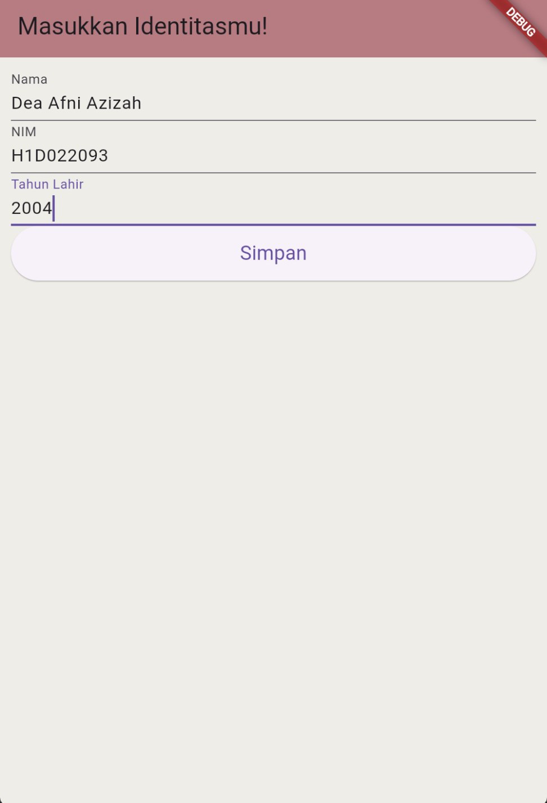
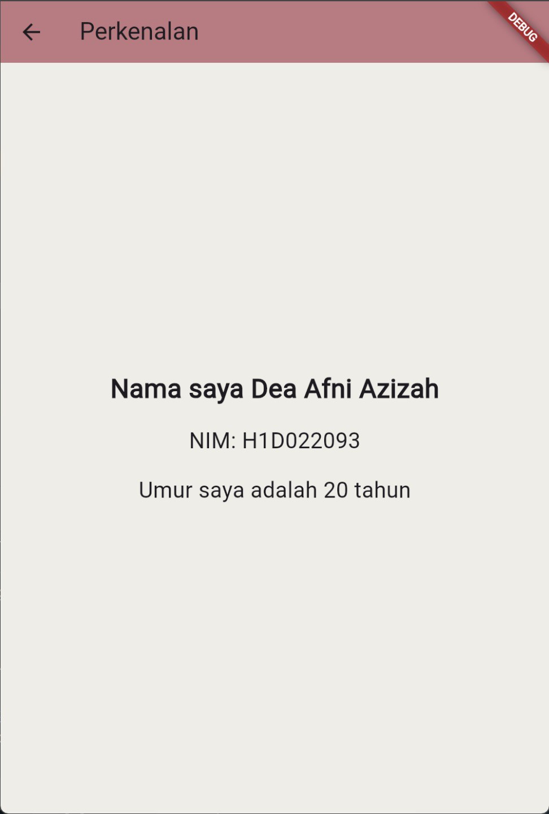

# Tugas Pertemuan 2

Fork dan clone repository ini, lalu jalankan perintah 
```
flutter pub get
```
Buatlah tampilan form yang berisi nama, nim, dan tahun lahir pada file `ui/form_data.dart`, lalu buatlah tampilan hasil dari input data tersebut pada file `ui/tampil_data.dart`

JELASKAN PROSES PASSING DATA DARI FORM MENUJU TAMPILAN DENGAN FILE `README.md`

Buat tampilan semenarik mungkin untuk dilihat.


Nama : Dea Afni Azizah

NIM : H1D022093

Shift Baru: C

Proses Passing Data:
1. Di layar form (LayarForm), data dikumpulkan dari TextEditingController setelah pengguna menekan tombol.
2. Data dikirim ke layar tujuan (TampilData) menggunakan Navigator.of(context).push.
3. MaterialPageRoute digunakan untuk membuat rute baru dan menyertakan data sebagai parameter dalam konstruktor TampilData.
4. Di layar tujuan (TampilData), data diterima melalui parameter konstruktor dan digunakan untuk menampilkan informasi yang sesuai.

## Screenshot
Contoh :


